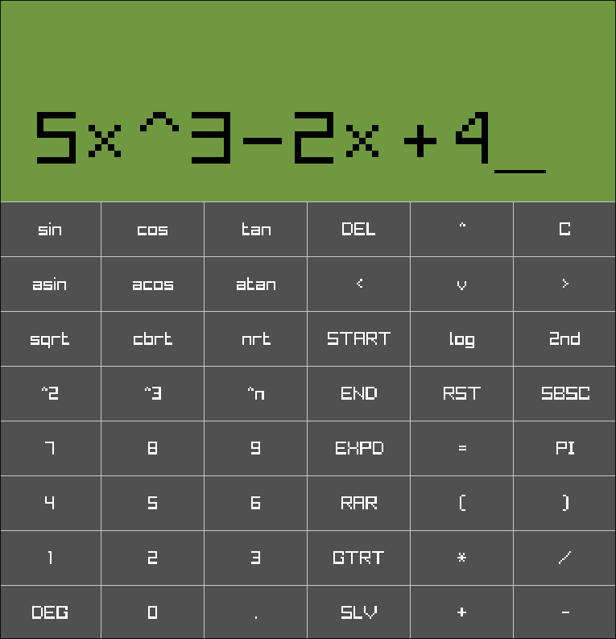
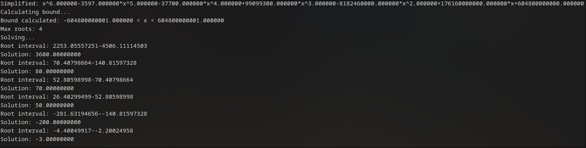

# Computer Algebra System Library

This is an incomplete calculator/computer algebra library. It was a summer project of mine, and I'm happy with the state
of it. Wouldn't recommend using for your own projects, though.

# Project

Now that this is in a state that I would consider complete (besides the inevitable bugfixes, of course), I'm reflecting
on both what went well and what I can improve.

# The Good

I'm very happy with the speed and efficiency of it. It's plenty fast enough for its needs, uses little enough memory
that it would work in an embedded system (which is the plan!), and seems robust enough for most operations. Throughout
the course of this project, I was learning about all sorts of algorithms for implementation. Here's some of them that
are in this project that I'm now comfortable with:

- Newton's method for roots
- CORDIC
- IEEE-754 floating point
- Euclidean algorithm for GCF, both integer and polynomial
- Polynomial long division
- Taylor series logarithms
- Bisection method for finding roots
- Budan's theorem
- Cauchy's Rule
- Yun's algorithm
- Finite State Machines (used here in lexing)

Part of what helped with this was my challenge of not using any libraries for anything other than debugging. This
includes the C standard library. I'm proud of myself for sticking to this rule, and I have succeeded in this to my
satisfaction. It's a great challenge if one is wanting to improve their skills in doing everything from scratch.

# The Bad

Here's a couple things I would do differently, were I to do this project again.

### Use the standard library

I do not regret handicapping myself into not using this, as I feel it was great for learning. However, now that I've
done a project without it, I can certainly see where it would be helpful. The biggest help would be heap memory
functions. Using stack buffers for everything worked to a point, but it has led to some issues. Not only were buffer
overflow issues, but I can't turn on optimization without breaking all of these buffers. I'm sure I could debug my way
through the mess, though heap allocation wouldn't have had those problems

### Use proper debugging techniques

At the start of this project, I wasn't even using debuggers. I had walls of printf statements debugging everything.
Throughout the summer, I've learned to use debuggers like GDB and CLion's integrated one. These have been tremendous
help, but there are areas that still need improvement. I should have set up proper testbench code for evaluating if
logic works or not. I ran into a number of situations where a change would inadvertently break other cases. If all tests
were run through, this wouldn't be a problem.

### Get the Name Right

Throughout this entire project, I thought Budan's theorem was called Bundan's theorem. I do not have the energy to
change
this, but it's worth a mention because it's hilarious.

### Use CMake

I was building my project using a makefile. For my next C project, I'm going to use CMake in order to have more features
and more cross-compatibility.

### Base the logic on bignum fractions

This was probably my biggest mistake of the project. I used doubles for everything in this library. While that made
things simpler, it has severely handicapped what the capabilities are. Floating-point numbers have limits, and the loss
of precision is especially apparent when the numbers get bigger. I've had to cap the roots function at 9 digits because
of this.

What I should have done is instead run everything on fractions. For storing the numerator and denominator, I would have
used a bignum implementation that can dynamically change how much memory is allocated. This would definitely need the
heap so wasn't going to be easy with the restrictions I gave myself, but it would have dramatically expanded what this
calculator is capable of. While irrational numbers would be a challenge, I can think of a number of ways they could be
implemented. If I design something similar to this in the future, I will definitely do it this way.

# Next Steps

All in all, I'm very happy with how this has turned out. I'm proud of what I've accomplished this summer and feel that
I've learned a lot of useful stuff. Next, I'm going to get a physical design together, then throw this onto hardware! 

# Showcase Images

*Screenshot of the embedded demo GUI*

*Output demonstrating the steps in root-finding*

*This library running on an STM32*
